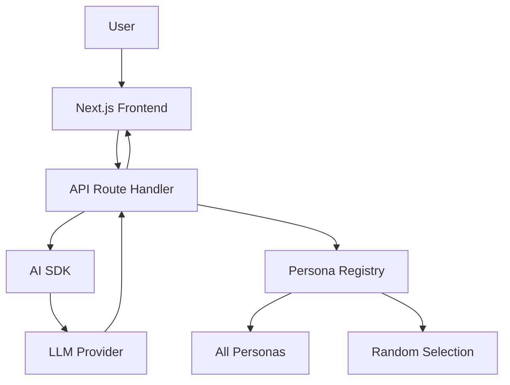
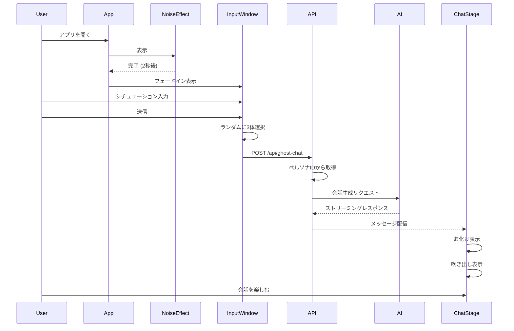

# Design Document

## Overview

Kiroween Ghost Chatは、Next.js 15（App Router）とVercel AI SDKを使用したインタラクティブなハロウィンアプリケーションです。ユーザーが入力したシチュエーションに基づいて、複数のお化けキャラクターがAIによって生成された会話を展開します。日本語と英語の切り替えに対応しています。

### Technology Stack

- **Framework**: Next.js 16 (App Router)
- **AI Integration**: Vercel AI SDK
- **Styling**: Tailwind CSS
- **Animation**: Motion (formerly Framer Motion)
- **Language**: TypeScript
- **Internationalization**: next-intl

## Architecture

### High-Level Architecture



### Component Structure

```
app/
├── [locale]/
│   ├── page.tsx              # メインページ（起動演出 + 入力UI）
│   └── chat/
│       └── page.tsx          # チャット画面
├── api/
│   └── ghost-chat/
│       └── route.ts          # AI会話生成APIエンドポイント
components/
├── NoiseEffect.tsx           # ノイズエフェクト
├── InputWindow.tsx           # シチュエーション入力UI
├── GhostCharacter.tsx        # お化けキャラクター表示
├── SpeechBubble.tsx          # 吹き出し表示
├── ChatStage.tsx             # チャット全体のステージ
└── LanguageSwitcher.tsx      # 言語切り替えボタン
lib/
├── personas/
│   ├── skeleton.ts           # スケルトンのペルソナ
│   ├── pumpkin.ts            # カボチャのペルソナ
│   ├── witch.ts              # 魔女のペルソナ
│   ├── ghost.ts              # ゴーストのペルソナ（追加例）
│   ├── vampire.ts            # ヴァンパイアのペルソナ（追加例）
│   └── index.ts              # ペルソナマネージャー（全ペルソナ登録・ランダム選択）
├── ai/
│   └── chat-generator.ts     # AI会話生成ロジック
└── i18n/
    ├── config.ts             # i18n設定
    └── request.ts            # リクエストごとのロケール取得
messages/
├── ja.json                   # 日本語翻訳
└── en.json                   # 英語翻訳
public/
└── characters/
    ├── skeleton.svg          # スケルトン画像
    ├── pumpkin.svg           # カボチャ画像
    ├── witch.svg             # 魔女画像
    ├── ghost.svg             # ゴースト画像（追加例）
    └── vampire.svg           # ヴァンパイア画像（追加例）
```

## Components and Interfaces

### 1. NoiseEffect Component

起動時のノイズエフェクトを表示するコンポーネント。

```typescript
interface NoiseEffectProps {
  onComplete: () => void;
  duration?: number; // デフォルト: 2000ms
}
```

**実装方針:**
- Canvas APIまたはCSS animationを使用してノイズエフェクトを実現
- 指定された時間後にonCompleteコールバックを実行

### 1.5. LanguageSwitcher Component

言語切り替えボタンを表示するコンポーネント。

```typescript
interface LanguageSwitcherProps {
  currentLocale: 'ja' | 'en';
}
```

**実装方針:**
- next-intlのuseRouterを使用してロケール切り替え
- 日本語/英語のトグルボタン
- 画面右上に固定配置

### 2. InputWindow Component

シチュエーション入力UIを表示するコンポーネント。

```typescript
interface InputWindowProps {
  onSubmit: (situation: string) => void;
  isVisible: boolean;
}
```

**実装方針:**
- Motionでフェードインアニメーション
- 最大500文字の入力制限
- バリデーション付き送信ボタン

### 3. GhostCharacter Component

個々のお化けキャラクターを表示するコンポーネント。

```typescript
interface GhostCharacterProps {
  persona: Persona;
  position: { x: number; y: number };
  isActive: boolean; // 現在話しているかどうか
}
```

**実装方針:**
- SVGまたは画像でキャラクターを表示
- Motionで登場アニメーション
- isActiveがtrueの時、強調表示

### 4. SpeechBubble Component

お化けの発言を吹き出しで表示するコンポーネント。

```typescript
interface SpeechBubbleProps {
  message: string;
  persona: Persona;
  position: { x: number; y: number };
  onComplete?: () => void;
}
```

**実装方針:**
- キャラクターの近くに配置
- タイピングエフェクトで文字を表示
- ペルソナごとに異なるスタイル

### 5. ChatStage Component

チャット全体を管理するコンテナコンポーネント。

```typescript
interface ChatStageProps {
  situation: string;
}

interface ChatMessage {
  id: string;
  persona: PersonaType;
  message: string;
  timestamp: number;
}
```

**実装方針:**
- 複数のGhostCharacterとSpeechBubbleを配置
- AI APIから受信したメッセージを順次表示
- ストリーミングレスポンスに対応

## Data Models

### Persona Definition

```typescript
interface Persona {
  id: string; // ユニークID（例: 'skeleton', 'pumpkin', 'witch'）
  name: string;
  description: string;
  personality: string[];
  speakingStyle: string;
  speakingStyleEn?: string; // 英語用の話し方
  visualStyle: {
    color: string;
    icon: string;
    imagePath: string; // SVG画像のパス
  };
}
```

### Chat Message

```typescript
interface ChatMessage {
  id: string;
  personaId: string;
  message: string;
  timestamp: number;
}
```

### Conversation Context

```typescript
interface ConversationContext {
  situation: string;
  messages: ChatMessage[];
  selectedPersonas: Persona[];
  locale: 'ja' | 'en';
}
```

## AI Integration

### Conversation Generation Strategy

AI SDKを使用して、複数のお化けキャラクター間の会話を生成します。

**アプローチ:**

1. **システムプロンプト構築**
   - ユーザーが入力したシチュエーション
   - 参加する各ペルソナの定義
   - 会話のルール（交互に話す、自然な対話など）

2. **ストリーミング生成**
   - AI SDKの`streamText`を使用
   - 各発言を構造化されたフォーマットで生成
   - フロントエンドでリアルタイム表示

3. **会話フォーマット**
```typescript
// AI出力フォーマット
{
  "persona": "skeleton",
  "message": "おや、こんな夜更けに誰かいるのかい？"
}
```

### API Route Implementation

```typescript
// app/api/ghost-chat/route.ts
export async function POST(req: Request) {
  const { situation, personaIds, locale } = await req.json();
  
  // ペルソナIDから実際のペルソナオブジェクトを取得
  const personas = personaIds.map(id => getPersonaById(id)).filter(Boolean);
  
  // ペルソナ情報を取得
  const personaPrompts = personas.map(p => getPersonaPrompt(p, locale));
  
  // システムプロンプト構築（言語に応じて）
  const systemPrompt = buildSystemPrompt(situation, personaPrompts, locale);
  
  // AI SDK でストリーミング生成
  const result = await streamText({
    model: openai('gpt-4-turbo'),
    system: systemPrompt,
    messages: conversationHistory,
  });
  
  return result.toAIStreamResponse();
}
```

## Persona System

### Persona Registry

全てのペルソナは`lib/personas/index.ts`で一元管理され、開発者が簡単に追加できる仕組みになっています。

```typescript
// lib/personas/index.ts
import { skeletonPersona } from './skeleton';
import { pumpkinPersona } from './pumpkin';
import { witchPersona } from './witch';
// 新しいペルソナをここにインポート

export const allPersonas: Persona[] = [
  skeletonPersona,
  pumpkinPersona,
  witchPersona,
  // 新しいペルソナをここに追加
];

// ランダムに3体のペルソナを選択
export function selectRandomPersonas(count: number = 3): Persona[] {
  const shuffled = [...allPersonas].sort(() => Math.random() - 0.5);
  return shuffled.slice(0, Math.min(count, allPersonas.length));
}

// IDでペルソナを取得
export function getPersonaById(id: string): Persona | undefined {
  return allPersonas.find(p => p.id === id);
}
```

### Adding New Personas

新しいペルソナを追加する手順：

1. `lib/personas/`に新しいファイルを作成（例: `vampire.ts`）
2. Personaインターフェースに従ってペルソナを定義
3. `public/characters/`に対応するSVG画像を追加
4. `lib/personas/index.ts`の`allPersonas`配列に追加

### Default Personas

デフォルトで以下のペルソナが用意されています：

### Skeleton (スケルトン)

```typescript
export const skeletonPersona: Persona = {
  id: 'skeleton',
  name: 'ボーンズ',
  description: '陽気で軽口を叩くスケルトン',
  personality: [
    '明るくて社交的',
    'ジョークが好き',
    '骨に関するダジャレを言いがち'
  ],
  speakingStyle: '軽快で親しみやすい口調。「〜だぜ」「〜じゃん」などのカジュアルな語尾',
  speakingStyleEn: 'Casual and friendly tone. Uses contractions and informal language like "gonna", "wanna"',
  visualStyle: {
    color: '#E8E8E8',
    icon: '💀',
    imagePath: '/characters/skeleton.svg'
  }
};
```

### Pumpkin (カボチャ)

```typescript
export const pumpkinPersona: Persona = {
  id: 'pumpkin',
  name: 'パンプ',
  description: '元気いっぱいで少し天然なカボチャ',
  personality: [
    '好奇心旺盛',
    'ポジティブ',
    '少しおっちょこちょい'
  ],
  speakingStyle: '元気で明るい口調。「〜だよ！」「わぁ！」などの感嘆詞が多い',
  speakingStyleEn: 'Energetic and cheerful tone. Uses lots of exclamations like "Wow!", "Yay!"',
  visualStyle: {
    color: '#FF8C00',
    icon: '🎃',
    imagePath: '/characters/pumpkin.svg'
  }
};
```

### Witch (魔女)

```typescript
export const witchPersona: Persona = {
  id: 'witch',
  name: 'ウィルマ',
  description: '知的で少しミステリアスな魔女',
  personality: [
    '知識豊富',
    '落ち着いている',
    '時々意地悪な冗談を言う'
  ],
  speakingStyle: '丁寧だが少し古風な口調。「〜ですわ」「〜ですもの」などの語尾',
  speakingStyleEn: 'Polite but slightly archaic tone. Uses formal language with a mysterious flair',
  visualStyle: {
    color: '#8B4789',
    icon: '🧙‍♀️',
    imagePath: '/characters/witch.svg'
  }
};
```

## User Flow



## Animation Strategy

### 1. 起動演出
- ノイズエフェクト: 0-2秒
- Input Windowフェードイン: 2-2.5秒

### 2. お化け登場
- ランダムに選ばれた3体のお化けが順次登場（各0.3秒間隔）
- スケール + フェードインアニメーション

### 3. 会話表示
- 吹き出しがポップアップ表示
- タイピングエフェクトで文字表示
- 次の発言まで1-2秒の間隔

## Error Handling

### API Errors

```typescript
try {
  const response = await fetch('/api/ghost-chat', {
    method: 'POST',
    body: JSON.stringify({ situation, personas })
  });
  
  if (!response.ok) {
    throw new Error('会話の生成に失敗しました');
  }
} catch (error) {
  // エラーメッセージを表示
  showErrorMessage('お化けたちが現れませんでした。もう一度お試しください。');
}
```

### Input Validation

- 空文字チェック
- 最大文字数チェック（500文字）
- 不適切な内容のフィルタリング（オプション）

### AI Generation Failures

- タイムアウト処理（30秒）
- リトライロジック（最大3回）
- フォールバックメッセージ

## Testing Strategy

### Unit Tests
- ペルソナ定義の検証
- 入力バリデーションロジック
- メッセージフォーマット処理

### Integration Tests
- API routeのエンドツーエンドテスト
- AI SDK統合テスト

### E2E Tests
- ユーザーフロー全体のテスト
- アニメーション遷移の検証

## Performance Considerations

- AI APIレスポンスのストリーミング処理で体感速度を向上
- 画像/SVGの最適化
- Motionのアニメーション最適化
- 不要な再レンダリングの防止（React.memo、useMemo）

## Accessibility

- キーボード操作対応
- スクリーンリーダー対応（ARIA属性）
- 十分なコントラスト比
- アニメーションの無効化オプション（prefers-reduced-motion）


## Internationalization (i18n)

### Configuration

next-intlを使用して日本語と英語の切り替えを実装します。

```typescript
// lib/i18n/config.ts
export const locales = ['ja', 'en'] as const;
export const defaultLocale = 'ja' as const;
export type Locale = (typeof locales)[number];
```

### Translation Files

```json
// messages/ja.json
{
  "home": {
    "inputPlaceholder": "シチュエーションを入力してください...",
    "submitButton": "お化けを呼ぶ",
    "maxLength": "最大500文字"
  },
  "errors": {
    "generationFailed": "お化けたちが現れませんでした。もう一度お試しください。",
    "emptyInput": "シチュエーションを入力してください"
  }
}

// messages/en.json
{
  "home": {
    "inputPlaceholder": "Enter a situation...",
    "submitButton": "Summon Ghosts",
    "maxLength": "Max 500 characters"
  },
  "errors": {
    "generationFailed": "Failed to summon ghosts. Please try again.",
    "emptyInput": "Please enter a situation"
  }
}
```

### Routing

Next.js 16のApp Routerで`[locale]`動的セグメントを使用：
- `/ja` - 日本語
- `/en` - 英語
- `/` - デフォルトロケール（日本語）にリダイレクト

### AI Prompt Localization

AI生成時にロケールに応じてシステムプロンプトと話し方を切り替え：
- 日本語: 各ペルソナの`speakingStyle`を使用
- 英語: 各ペルソナの`speakingStyleEn`を使用


## Character Assets

### Image Format and Location

キャラクター画像はSVG形式で`public/characters/`ディレクトリに保存します。

**ファイル構成:**
```
public/characters/
├── skeleton.svg    # スケルトン（ボーンズ）
├── pumpkin.svg     # カボチャ（パンプ）
├── witch.svg       # 魔女（ウィルマ）
├── ghost.svg       # ゴースト（追加例）
└── vampire.svg     # ヴァンパイア（追加例）
```

新しいキャラクターを追加する際は、対応するSVGファイルを`public/characters/`に配置し、ペルソナ定義の`imagePath`で参照します。

**画像仕様:**
- フォーマット: SVG（スケーラブルでアニメーション対応）
- 推奨サイズ: 200x200px（viewBox）
- 背景: 透過
- スタイル: ハロウィンらしいかわいいイラスト風

**使用方法:**
```typescript
// GhostCharacter.tsx
import Image from 'next/image';

<Image
  src={persona.visualStyle.imagePath}
  alt={persona.name}
  width={150}
  height={150}
  priority
/>
```

### Fallback Strategy

画像が読み込めない場合は、絵文字アイコン（`persona.visualStyle.icon`）をフォールバックとして表示します。
